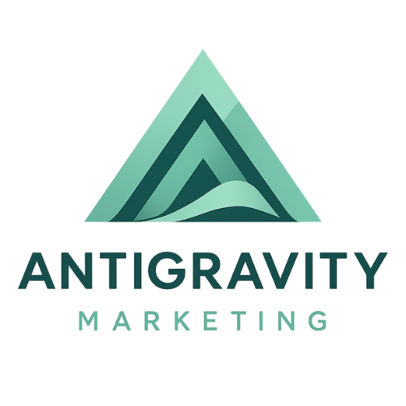

<div align="center">
  

  # 🚀 Antigravity Marketing Kit

  > **26 specialized marketing skills, 4 expert agents, and 4 streamlined workflows.**
  > Your ultimate AI-powered marketing command center for the Gemini CLI.

  [](https://www.npmjs.com/package/@nguyenphp/antigravity-marketing)
  [](https://opensource.org/licenses/MIT)
  [](https://github.com/nguyenphp/antigravity-marketing/stargazers)

</div>

---

## 🌟 Transform Your Marketing Workflow

Antigravity Marketing Kit is not just a tool; it's a **powerful AI strategy layer** designed to eliminate manual marketing drudgery. Whether you're a growth hacker, a content creator, or a data-driven strategist, this kit provides the precise intelligence you need to scale.

> **Built on the shoulders of giants.** Based on [Antigravity Kit](https://github.com/vudovn/antigravity-kit), the definitive framework for AI agent skills.

### Why Antigravity?
- **🧠 Domain Expertise**: 26 skills covering the entire marketing spectrum.
- **🤖 Specialized Agents**: Content, Growth, Strategy, and Analytics experts at your service.
- **🔄 Proven Workflows**: Turn complex tasks into simple commands.
- **🎬 Video Automation**: Programmatic high-fidelity marketing videos via Remotion.

---

## 🎥 Video Showcase (Automated Production)

✨ **Power of Remotion**: This toolkit inherits cutting-edge video-automation skills, enabling programmatic creation of viral marketing content.

| YouTube (16:9) | TikTok / Reels (9:16) |
|:---:|:---:|
| <video src="https://github.com/nguyenphp/antigravity-marketing/raw/main/docs/assets/videos/antigravity-promo-169.mp4" width="100%" controls></video> | <video src="https://github.com/nguyenphp/antigravity-marketing/raw/main/docs/assets/videos/antigravity-promo-916.mp4" width="100%" controls></video> |

## 🧠 Skills (26)

### Content & Creative
| Skill | Description |
|-------|-------------|
| `content-marketing` | Content strategy, copywriting, storytelling |
| `branding-expert` | Brand identity, voice & tone, style guides |
| `video-marketing` | Video strategy, YouTube SEO, short-form content |
| `video-automation` | **Automated marketing videos via Remotion** |
| `content-repurposing` | Transform content into multiple formats |

### Growth & Acquisition
| Skill | Description |
|-------|-------------|
| `growth-hacking` | Viral loops, referral programs, AARRR framework |
| `ppc-advertising` | Google Ads, Meta Ads, campaign optimization |
| `influencer-marketing` | Influencer outreach, KOL partnerships |
| `affiliate-marketing` | Affiliate programs, partner networks |
| `lead-gen-scraper` | Lead generation, prospect research |

### Channels
| Skill | Description |
|-------|-------------|
| `social-media-expert` | Platform strategies (FB, IG, TikTok, LinkedIn) |
| `email-marketing` | Campaigns, sequences, automation, newsletters |

### Optimization & Analytics
| Skill | Description |
|-------|-------------|
| `seo-fundamentals` | SEO best practices, E-E-A-T, Core Web Vitals |
| `keyword-research-deep` | Advanced keyword research, clustering, intent |
| `analytics-marketing` | KPIs, attribution, GA4, dashboards |
| `conversion-optimization` | CRO, A/B testing, landing pages |
| `marketing-automation` | Lead nurturing, workflows, segmentation |
| `ab-test-dashboard` | A/B test analysis, statistical significance |

### Ads & Creative
| Skill | Description |
|-------|-------------|
| `ad-creative-variations` | Mass ad copy variations for Meta/Google/TikTok |

### Competitor Intelligence
| Skill | Description |
|-------|-------------|
| `competitor-teardown` | Analyze competitor websites, ads, strategies |
| `competitor-monitor` | Monitor competitor changes and alerts |

### Design & Development
| Skill | Description |
|-------|-------------|
| `ui-ux-pro-max` | Design intelligence for marketing |
| `frontend-design` | Landing page & web design |
| `tailwind-patterns` | Utility-first CSS patterns |
| `documentation-templates` | Marketing documentation templates |
| `remotion-best-practices` | **Official Remotion video production rules** |

## 🤖 Agents (4)

| Agent | Description |
|-------|-------------|
| `marketing-strategist` | Overall marketing strategy orchestrator |
| `content-creator` | Content creation specialist |
| `growth-specialist` | Growth hacking specialist |
| `analytics-specialist` | Data analysis and insights |

## 🔄 Workflows (4)

| Command | Description |
|---------|-------------|
| `/campaign` | Create marketing campaign |
| `/content` | Content creation workflow |
| `/analyze` | Marketing analytics workflow |
| `/optimize` | Conversion optimization workflow |

## 📦 Installation

### Install Global (Recommended)

```bash
# Install globally
npm install -g @nguyenphp/antigravity-marketing

# Navigate to your project
cd your-project

# Install .agent folder
ag-marketing-kit init

# Update to latest version
ag-marketing-kit update

# Check status
ag-marketing-kit status

# List all skills
ag-marketing-kit list
```

### Using npx (No Install)

```bash
# Navigate to your project
cd your-project

# Install .agent folder
npx @nguyenphp/antigravity-marketing init
```

### CLI Commands

| Command | Description |
|---------|-------------|
| `ag-marketing-kit init` | Install .agent folder |
| `ag-marketing-kit update` | Update to latest version |
| `ag-marketing-kit status` | Check installation status |
| `ag-marketing-kit list` | List all available skills |

#### Command Options

```bash
# init options
ag-marketing-kit init [options]
  -f, --force          # Overwrite if folder exists
  -p, --path <dir>     # Path to project directory
  -b, --branch <name>  # Select repository branch

# update options
ag-marketing-kit update [options]
  -f, --force          # Skip confirmation
  -p, --path <dir>     # Path to project directory
  -b, --branch <name>  # Select repository branch
```

## 🚀 Usage

### Skills

Skills are automatically detected and used by Gemini CLI based on context.

### Workflows

Invoke workflows with slash commands:

```
/campaign - Start a marketing campaign workflow
/content - Create content with guidance
/analyze - Analyze marketing metrics
/optimize - Run conversion optimization
```

## 🤝 Contributing

Contributions are welcome! Please feel free to submit a Pull Request.

### Adding a New Skill

1. Create folder in `templates/.agent/skills/your-skill/`
2. Add `SKILL.md` with YAML frontmatter and content
3. Submit PR

### Adding a New Workflow

1. Create file in `templates/.agent/workflows/your-workflow.md`
2. Add description frontmatter and steps
3. Submit PR

## 📄 License

MIT License - see [LICENSE](LICENSE) for details.
